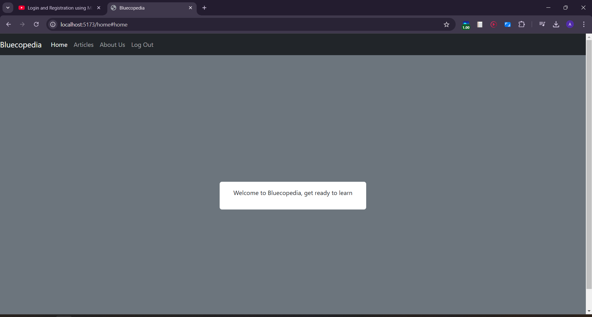

# BlueEco-pedia

### Project Submission για τον Διαγωνισμό 2nd Blue & Circular Economy Hackathon

## Εισαγωγή
Το BlueEco-pedia είναι ένα έργο που αναπτύχθηκε για τον 2ο Διαγωνισμό Blue & Circular Economy Hackathon. Σκοπός του είναι να παρέχει πληροφορίες και πόρους σχετικά με τις πρακτικές της μπλε και κυκλικής οικονομίας, μέσα από έναν ευχάριστο, διαδραστικό τρόπο.

## Τεχνολογίες που Χρησιμοποιούνται
- **Frontend**: React, Vite, Bootstrap, React Router
- **Backend**: Node.js, Express, CORS, Body-Parser
- **Βάση Δεδομένων**: Αρχείο JSON για τοπική αποθήκευση
- **Άλλα Εργαλεία**: Axios για HTTP αιτήσεις, ESLint για έλεγχο κώδικα

## Ξεκινώντας

### Προαπαιτούμενα
Πριν ξεκινήσετε, βεβαιωθείτε ότι έχετε εγκαταστήσει τα εξής:
- [Node.js](https://nodejs.org/)
- npm (Node Package Manager, περιλαμβάνεται με το Node.js)

### Εγκατάσταση
1. **Δημιουργήστε ένα fork του repository στο GitHub.**
2. **Κλωνοποίηση του forked repository:**
```bash
git clone https://github.com/<το-όνομα-χρήστη-σας>/BlueEco-pedia.git
cd BlueEco-pedia
```

3. **Προσθήκη του αρχικού αποθετηρίου ως upstream remote:**
```bash
git remote add upstream https://github.com/UniversityOfAthens/BlueEco-pedia.git
```

### Εκτέλεση του Backend
Προσοχή: Για να εκτελέσετε τοπικά το web app θα πρέπει ταυτόχρονα να τρέχει και το backend μέρος της εφαρμογής αλλά και το frontend. Επομένως, καλό θα ήταν να έχετε ανοιχτό το τερματικό της επιλογής σας με 2 tabs ανοιχτά (ένα για το frontend και ένα για το backend).

1. **Μεταβείτε στον κατάλογο του backend:**
```bash
cd backend
```

2. **Εγκατάσταση εξαρτήσεων του backend:**
```bash
npm install
```

3. **Εκκίνηση του backend server:**
```bash
npm start
```

ή με nodemon:

```bash
npm start dev
```

Ο backend server θα τρέχει στο `http://localhost:3482`. (Δεν έχει κάτι να δείτε εκεί)

<center>


</center>

### Εκτέλεση του Frontend

1. **Μεταβείτε στον κατάλογο του frontend:**
```bash
cd frontend
```

2. **Εγκατάσταση εξαρτήσεων του frontend:**
```bash
npm install
```

3. **Εκκίνηση του frontend development server:**
```bash
npm run dev
```

<center>


Ο frontend development server θα τρέχει στο http://localhost:5173/.
Προκειμένου να δείτε την εφαρμογή θα πρέπει να μπείτε στο παραπάνω link. Κάθε φορά που αλλάζετε κάτι και πατάτε save, θα κάνει αυτόματα reload (ωστόσο κάποιες φορές μπορεί να κολλάει και να πρέπει να πατήσετε στο terminal Ctrl+C και ξανά npm run dev).

Θα πρέπει να φαίνεται κάπως έτσι:




## Συμμετοχή

### Δημιουργία Branch
1. **Δημιουργήστε ένα νέο branch για να προσθέσετε/διορθώσετε οτιδήποτε:**
```bash
git checkout -b <όνομα-κλάδου>
```
Παράδειγμα:
```bash
git checkout -b fix-bug-login
```
Καλό θα ήταν το όνομα του branch να είναι σχετικό με αυτό που κάνετε, προς διευκόλυνση όλων. 

### Κάνοντας Αλλαγές
1. **Κάντε τις αλλαγές σας στον κώδικα.**
2. **Προσθέστε τις αλλαγές σας:**
```bash
git add .
```

3. **Commit των αλλαγών σας:**
```bash
git commit -m "Περιγραφή των αλλαγών"
```

### Δημιουργία Pull Request
1. **Σπρώξτε το branch σας στο forked repo:**
```bash
git push origin <όνομα-κλάδου>
```

2. **Δημιουργήστε ένα pull request από το branch σας προς τον κλάδο main του αρχικού repo.**

3. **Περιμένετε να το εγκρίνουμε :D**
